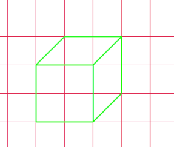

# Assignment: Lined cube

*PLEASE READ THIS **ENTIRE** DOCUMENT FIRST*

* [the assignment](#the-assignment)
* [submitting-your-work](#submitting-your-work)

## The assignment

Open a new file in your IDE

* Using vanilla javascript (no libraries allowed), create an array of 500 numbers. The first half must be a random number between 10 and 300. The second half has to be a random number between 500 and 700.
* Determine the largest number in the array. Use only loops, variables and if statements, no ready made methods allowed.
* Using javascript, create a paragraph element inside your HTML.
* Set the content of the paragraph element to be:
`From the array of ${amountOfnumbers} numbers, the number ${largestNumber} is the largest. This number is at index ${indexLargestNumber} in the array.`

Tip: Be mindful that you use the 'tick' (the character under the escape key for windows or next to the z key for mac) as apostrophes, the so called template literal. This way you can use the variables amountOfNumbers, largestNumber and indexLargestNumber cleanly in one line of text.

## Submitting your work
Create a new branch called **gh-pages** and upload your local work into this branch. Submit a new **pull request** and make sure to put the (working) **GitHub Pages URL** in the comment section. 
